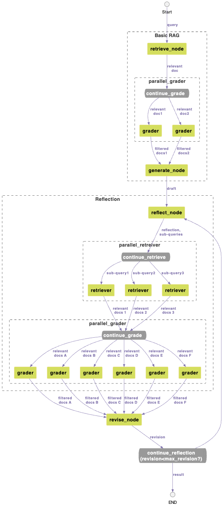

# Reflection을 이용한 RAG의 성능 향상 

RAG의 결과가 충분한 context를 포함하고 있지 않은 경우에 [Query Tansformation](https://github.com/kyopark2014/korean-chatbot-using-amazon-bedrock/blob/main/query-transformation.md)을 이용하면, 다양한 sub queries를 통해 풍부한 context를 가지는 결과를 얻을 수 있습니다. 그러나, 질문(query)이 짧은 경우에는 query transformation으로 얻어진 결과가 늘어난 지연 시간만큼 효과를 얻지 못할 수 있습니다. 또한 chatbot의 경우에 [이전 history를 이용해 질문을 rephrase](https://medium.com/thedeephub/rag-chatbot-powered-by-langchain-openai-google-generative-ai-and-hugging-face-apis-6a9b9d7d59db)하므로 query transformation을 통해 질문을 명확하게(rewrite) 하더라도 RAG의 결과가 충분히 좋아지지 않습니다. 

여기서에서는 Reflection을 이용한 RAG의 성능 강화에 대해 설명합니다. Reflection을 통해 RAG로 얻어진 결과에서 새로운 sub-queries들을 생성하여, 답변에 충분한 context를 제공할 수 있습닏. 따라서, Query transformation와 유사하게 질문과 관련된 문서를 조회할 수 있습니다. 

## RAG with Reflection

## Query Transformation

