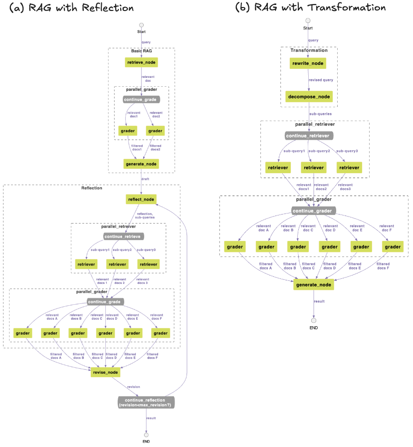

# Reflection을 이용한 RAG의 성능 향상 

<a href="https://hits.seeyoufarm.com"></a>


여기에서는 LangGraph를 이용하여 기본 RAG를 구현하고, [reflection](https://github.com/kyopark2014/langgraph-agent/blob/main/reflection-agent.md)과 [query transformation](https://github.com/kyopark2014/korean-chatbot-using-amazon-bedrock/blob/main/query-transformation.md)을 이용하여 RAG의 성능을 향상시키는 방법을 비교하여 설명합니다. RAG를 이용함으로써 필요한 시점에 적절한 비용으로 기업의 데이터를 활용한 애플리케이션을 개발할 수 있습니다. 하지만, 자연으로 질의되는 사용자의 요청으로부터 사용자의 의도를 정확히 파악하고, 관련된 문서들로 부터 꼭 필요한 문서만을 선택하고, 한국어와 영어 문서를 모두 조회하려면 다양한 노력이 필요합니다.

Reflection과 transformation을 이용하였을 때의 activity diagram은 아래와 같습니다. 여기에서 "(a) RAG with reflection"은 RAG를 조회하여 얻은 문서들을 이용하여 답변을 구한 후에, reflection을 통하여 답변에서 개선하여야 할 목록 및 추가로 검색을 수행하여 얻은 문서들로 향상된 답변을 생성합니다. "(b) RAG with Transformation"은 사용자의 질문을 갱신(rewrite)한 후에 추가적으로 검색할 질문들을 생성(decompose)하여 RAG를 조회합니다. 



Reflection은 생성한 답변으로 부터 추가 질문을 추출하여 RAG를 조회하므로, 처음 답변보다 더 많은 정보를 활용할 수 있습니다. 하지만, RAG를 통해 얻은 답변을 갱신하는 과정에서 다수의 새로운 추가 질문을 생성하여 조회하므로, RAG 조회 비용이 대폭 늘어나고, 처리 시간 증가가 불가피합니다. 

Transformation은 RAG를 조회하기 위해 질문을 명확히 하고 관련된 세부 질문을 미리 생성하여 검색하므로 사용자의 질문과 좀더 가까운 문서들을 검색하여 활용할 수 있습니다. Query tansformation은 질문(query)이 짧은 경우에는 질문을 rewrite하거나 decompose하는 효과가 높지 않으며, chatbot같은 애플리케이션에서는 [이전 history를 이용해 질문을 rephrase](https://medium.com/thedeephub/rag-chatbot-powered-by-langchain-openai-google-generative-ai-and-hugging-face-apis-6a9b9d7d59db)을 수행하므로 query transformation을 통해 질문을 명확하게(rewrite) 하는 과정이 중복 동작일 수 있습니다. 

여기서 구현된 architecture는 아래와 같습니다. 유지보수 및 변화하는 트래픽에 강점이 있는 serverless architecture를 사용하였고, RAG로는 Amazon Bedrock Knowledge Base를 활용하였습니다. 


## LangGraph를 이용한 RAG의 구현

### Basic RAG 

기본 RAG를 구현하기 위한  activity diagram 아래와 같습니다. Retrieve 노드에서 RAG로 사용자의 질문을 전달하여 관련된 문서(relevant document)들을 가져옵니다. RAG에 질문과 관련된 문서들이 없는 경우에는 관련도가 떨어지는 문서들이 선택될 수 있으므로 grading을 통해 문서를 선택합니다. 이후 generate 노드에서 사용자의 질문과 관련된 문서를 이용하여 결과를 얻습니다.


LangGraph로 아래와 같이 workflow를 구성합니다. 여기 노드(node)에는 retrieve_node, parallel_grader, generate_node가 있습니다. retrieve_node는 RAG에 질의하고, parallel_grader는 가져온 관련된 문서를 검증하고, generate_node에서 답변을 생성합니다. 

```python
class State(TypedDict):
    query: str
    draft: str
    relevant_docs: List[str]
    filtered_docs: List[str]
    reflection : List[str]
    sub_queries : List[str]
    revision_number: int

def buildRagBasic():
    workflow = StateGraph(State)

    # Add nodes
    workflow.add_node("retrieve_node", retrieve_node)
    workflow.add_node("parallel_grader", parallel_grader)
    workflow.add_node("generate_node", generate_node)

    # Set entry point
    workflow.set_entry_point("retrieve_node")
    
    workflow.add_edge("retrieve_node", "parallel_grader")
    workflow.add_edge("parallel_grader", "generate_node")
            
    return workflow.compile()
```

기본 RAG를 실행할 때에는 아래와 같이 입력으로 query를 이용하여 LangGraph로 생성한 앱을 수행합니다. 수행이 완료되면 State의 draft를 추출하여 답변으로 전달합니다.

```python
def run_rag_basic(connectionId, requestId, query):    
    app = buildRagBasic()
    
    # Run the workflow
    isTyping(connectionId, requestId)        
    inputs = {
        "query": query
    }    
    config = {
        "recursion_limit": 50
    }
    
    output = app.invoke(inputs, config)
    
    return output['draft']
```

RAG에서 관련된 문서를 가져오는 함수는 아래와 같습니다. State에서 query를 추출하여 [Bedrock Knowledge Base](https://github.com/kyopark2014/korean-chatbot-using-amazon-bedrock/blob/main/rag-knowledge-base.md)를 이용해 구성한 RAG에 관련된 문서를 추출해서 전달하도록 요청합니다. 

```python
def retrieve_node(state: State):
    print("###### retrieve ######")
    query = state['query']
    relevant_docs = retrieve_from_knowledge_base(query)
    
    return {
        "relevant_docs": relevant_docs
    }
```

아래와 같이 RAG의 지식저장소로부터 얻어진 관련된 문서를 grading합니다. 여러번 grading을 수행하여야 하므로 [Process-based parallelism](https://docs.python.org/ko/3/library/multiprocessing.html)을 사용하였습니다. 

```python
def parallel_grader(state: State):
    print("###### parallel_grader ######")
    query = state['query']
    relevant_docs = state['relevant_docs']
    
    global selected_chat    
    filtered_docs = []    

    processes = []
    parent_connections = []
    
    for i, doc in enumerate(relevant_docs):
        parent_conn, child_conn = Pipe()
        parent_connections.append(parent_conn)
            
        process = Process(target=grade_document_based_on_relevance, args=(child_conn, query, doc, multi_region_models, selected_chat))
        processes.append(process)

        selected_chat = selected_chat + 1
        if selected_chat == len(multi_region_models):
            selected_chat = 0
    for process in processes:
        process.start()
            
    for parent_conn in parent_connections:
        doc = parent_conn.recv()

        if doc is not None:
            filtered_docs.append(doc)

    for process in processes:
        process.join()    
    
    return {
        "filtered_docs": filtered_docs
    }    
```

여기에서는 관련도를 판단하기 위하여 LLM을 이용하 grading을 "yes/no"로 판정하였습니다. 

```python
def get_retrieval_grader(chat):
    system = """You are a grader assessing relevance of a retrieved document to a user question. \n 
    If the document contains keyword(s) or semantic meaning related to the question, grade it as relevant. \n
    Give a binary score 'yes' or 'no' score to indicate whether the document is relevant to the question."""

    grade_prompt = ChatPromptTemplate.from_messages(
        [
            ("system", system),
            ("human", "Retrieved document: \n\n {document} \n\n User question: {question}"),
        ]
    )
    
    structured_llm_grader = chat.with_structured_output(GradeDocuments)
    retrieval_grader = grade_prompt | structured_llm_grader
    return retrieval_grader

def grade_document_based_on_relevance(conn, question, doc, models, selected):     
    chat = get_multi_region_chat(models, selected)
    retrieval_grader = get_retrieval_grader(chat)
    score = retrieval_grader.invoke({"question": question, "document": doc.page_content})
    
    grade = score.binary_score    
    if grade == 'yes':
        print("---GRADE: DOCUMENT RELEVANT---")
        conn.send(doc)
    else:  # no
        print("---GRADE: DOCUMENT NOT RELEVANT---")
        conn.send(None)
    
    conn.close()
```

 
### RAG with Reflection

기본 RAG에 reflection을 추가하여, RAG로 부터 생성된 답변을 강화합니다. 


   

아래는 reflection을 위한 workflow입니다. reflect_node에서는 이전 답변(draft)로 부터 개선점을 추출하고, 관련된 3개의 query를 생성합니다. parallel_retriever는 3개의 query를 병렬로 조회하여 관련된 문서(relevant documents)를 얻고, parallel_grader를 이용하여 grading한 후에 revise_node를 이용하여 향상된 답변을 얻습니다. 

```python
def buildRagWithReflection():
    workflow = StateGraph(State)

    # Add nodes
    workflow.add_node("retrieve_node", retrieve_node)
    workflow.add_node("parallel_grader", parallel_grader)
    workflow.add_node("generate_node", generate_node)
    
    workflow.add_node("reflect_node", reflect_node)    
    workflow.add_node("parallel_retriever", parallel_retriever)    
    workflow.add_node("parallel_grader_subqueries", parallel_grader)
    workflow.add_node("revise_node", revise_node)

    # Set entry point
    workflow.set_entry_point("retrieve_node")
    
    workflow.add_edge("retrieve_node", "parallel_grader")
    workflow.add_edge("parallel_grader", "generate_node")
    
    workflow.add_edge("generate_node", "reflect_node")
    workflow.add_edge("reflect_node", "parallel_retriever")    
    workflow.add_edge("parallel_retriever", "parallel_grader_subqueries")    
    workflow.add_edge("parallel_grader_subqueries", "revise_node")
    
    workflow.add_conditional_edges(
        "revise_node", 
        continue_reflection, 
        {
            "end": END, 
            "continue": "reflect_node"}
    )
        
    return workflow.compile()
```

Reflection은 초안(draft)로 부터 아래와 같이 [structured output](https://github.com/kyopark2014/langgraph-agent/blob/main/structured-output.md)을 이용하여 추출합니다. 추출된 결과에는 reflection과 관련하여 missing, advisable, superfluous을 얻어서 문자의 개선에 도움을 줄 수 있으며, sub_queries를 이용해 1-3개의 새로운 질문을 생성합니다. RAG에서는 embedding을 통해 한국어로 영어로된 문서를 찾을 수 있으나 유사한 한글 문서가 많은 경우에는 유용한 영어 문서를 참조하지 못할 수 있습니다. 따라서 여기에서는 생성된 sub_query가 한국어일 경우에는 번역하여 영어로 된 sub_query를 추가합니다. 또한 reflection으로 답변에 부족한 부분이나, 추가되어야할 내용, 길이/스타일에 대한 정보를 추출하여 답변을 향상시킬 수 있습니다.

```python
class Reflection(BaseModel):
    missing: str = Field(description="Critique of what is missing.")
    advisable: str = Field(description="Critique of what is helpful for better writing")
    superfluous: str = Field(description="Critique of what is superfluous")
class Research(BaseModel):
    """Provide reflection and then follow up with search queries to improve the question/answer."""

    reflection: Reflection = Field(description="Your reflection on the initial answer.")
    sub_queries: list[str] = Field(
        description="1-3 search queries for researching improvements to address the critique of your current answer."
    )
class ReflectionKor(BaseModel):
    missing: str = Field(description="답변에 있어야하는데 빠진 내용이나 단점")
    advisable: str = Field(description="더 좋은 답변이 되기 위해 추가하여야 할 내용")
    superfluous: str = Field(description="답변의 길이나 스타일에 대한 비평")
class ResearchKor(BaseModel):
    """답변을 개선하기 위한 검색 쿼리를 제공합니다."""

    reflection: ReflectionKor = Field(description="답변에 대한 평가")
    sub_queries: list[str] = Field(
        description="답변과 관련된 3개 이내의 검색어"
    )

def reflect_node(state: State):
    print("###### reflect ######")
    query = state['query']
    draft = state['draft']
        
    reflection = []
    sub_queries = []
    for attempt in range(5):
        chat = get_chat()        
        if isKorean(draft):
            structured_llm = chat.with_structured_output(ResearchKor, include_raw=True)
            qa = f"질문: {query}\n\n답변: {draft}"    
        else:
            structured_llm = chat.with_structured_output(Research, include_raw=True)
            qa = f"Question: {query}\n\nAnswer: {draft}"
        
        info = structured_llm.invoke(qa)                
        if not info['parsed'] == None:
            parsed_info = info['parsed']
            reflection = [parsed_info.reflection.missing, parsed_info.reflection.advisable]
            sub_queries = parsed_info.sub_queries
                
            if isKorean(draft):
                translated_search = []
                for q in sub_queries:
                    chat = get_chat()
                    if isKorean(q):
                        search = traslation(chat, q, "Korean", "English")
                    else:
                        search = traslation(chat, q, "English", "Korean")
                    translated_search.append(search)
                        
                sub_queries += translated_search

            break
    return {
        "reflection": reflection,
        "sub_queries": sub_queries,
    }
```

parallel_retriever는 sub_queries만큼 병렬처리를 수행하여 속도를 개선합니다. 이때 retriever는 완젼관리형인 RAG 서비스인 knowledge base에서 관련된 문서를 가져옵니다. 

```python
def retriever(conn, query):
    relevant_docs = retrieve_from_knowledge_base(query)    
    print("---RETRIEVE: RELEVANT DOCUMENT---")
    
    conn.send(relevant_docs)    
    conn.close()
    
    return relevant_docs
    
def parallel_retriever(state: State):
    print("###### parallel_retriever ######")
    sub_queries = state['sub_queries']
    print('sub_queries: ', sub_queries)
    
    relevant_docs = []
    processes = []
    parent_connections = []
    
    for i, query in enumerate(sub_queries):
        print(f"retrieve sub_queries[{i}]: {query}")        
        parent_conn, child_conn = Pipe()
        parent_connections.append(parent_conn)
            
        process = Process(target=retriever, args=(child_conn, query))
        processes.append(process)

    for process in processes:
        process.start()
            
    for parent_conn in parent_connections:
        docs = parent_conn.recv()
        
        for doc in docs:
            relevant_docs.append(doc)

    for process in processes:
        process.join()    

    return {
        "relevant_docs": relevant_docs
    }
```

revise_node에서는 reflection으로 얻어진 reflection critique와 sub-quries를 이용해 조회한 관련된 문서들을 이용하여 아래와 같이 초안(draft)를 향상시킵니다. 

```python
def revise_node(state: State):   
    print("###### revise ######")
    draft = state['draft']
    reflection = state['reflection']
    
    if isKorean(draft):
        revise_template = (
            "당신은 장문 작성에 능숙한 유능한 글쓰기 도우미입니다."                
            "draft을 critique과 information 사용하여 수정하십시오."
            "최종 결과는 한국어로 작성하고 <result> tag를 붙여주세요."
                            
            "<draft>"
            "{draft}"
            "</draft>"
                            
            "<critique>"
            "{reflection}"
            "</critique>"

            "<information>"
            "{content}"
            "</information>"
        )
    else:    
        revise_template = (
            "You are an excellent writing assistant." 
            "Revise this draft using the critique and additional information."
            "Provide the final answer with <result> tag."
                            
            "<draft>"
            "{draft}"
            "</draft>"
                        
            "<critique>"
            "{reflection}"
            "</critique>"

            "<information>"
            "{content}"
            "</information>"
        )
                    
    revise_prompt = ChatPromptTemplate([
        ('human', revise_template)
    ])    
    filtered_docs = state['filtered_docs']
              
    content = []   
    if len(filtered_docs):
        for d in filtered_docs:
            content.append(d.page_content)        

    chat = get_chat()
    reflect = revise_prompt | chat
           
    res = reflect.invoke(
        {
            "draft": draft,
            "reflection": reflection,
            "content": content
        }
    )
    output = res.content
        
    revised_draft = output[output.find('<result>')+8:len(output)-9]
            
    revision_number = state["revision_number"] if state.get("revision_number") is not None else 1
            
    return {
        "draft": revised_draft,
        "revision_number": revision_number + 1
    }
```

이때, 초안은 MAX_REVISIONS만큼 반복하여 refection을 적용할 수 있습니다. 

```python
MAX_REVISIONS = 1

def continue_reflection(state: State, config):
    print("###### continue_reflection ######")
    max_revisions = config.get("configurable", {}).get("max_revisions", MAX_REVISIONS)
            
    if state["revision_number"] > max_revisions:
        return "end"
    return "continue"
```

### Query Transformation

RAG에 질문하기 전에 입력된 query를 변환하여 성능을 향상시키기 위해서는 아래와 같이 rewrite와 decompse 과정이 필요합니다. rewrite_node는 RAG에서 좀더 좋은 결과를 얻도록 query의 내용을 자세하게 풀어 적습니다. 이후 decompse_node에서는 RAG에서 조회할때 사용할 sub-quries들을 생성합니다. 여기에서는 [query_transformations.ipynb](https://github.com/NirDiamant/RAG_Techniques/blob/main/all_rag_techniques/query_transformations.ipynb)을 참조하여 query transformation을 위한 prompt를 생성합니다.


Transformation을 위한 workflow는 아래와 같습니다. RAG를 조회하기 전에 rewrite_node로 질문을 풀어서 쓰고, decompose_node로 상세한 질문들을 생성합니다. 

```python
def buildRagWithTransformation():
    workflow = StateGraph(State)

    # Add nodes
    workflow.add_node("rewrite_node", rewrite_node)
    workflow.add_node("decompose_node", decompose_node)
    workflow.add_node("parallel_retriever", parallel_retriever)
    workflow.add_node("parallel_grader", parallel_grader)
    workflow.add_node("generate_node", generate_node)
    
    # Set entry point
    workflow.set_entry_point("rewrite_node")
    
    # Add edges
    workflow.add_edge("rewrite_node", "decompose_node")
    workflow.add_edge("decompose_node", "parallel_retriever")
    workflow.add_edge("parallel_retriever", "parallel_grader")
    workflow.add_edge("parallel_grader", "generate_node")    
    workflow.add_edge("generate_node", END)
```

rewrite_node에서는 질문을 검색에 맞게 상세하게 풀어줍니다.

```python
def rewrite_node(state: State):
    print("###### rewrite ######")
    query = state['query']
    
    query_rewrite_template = (
        "You are an AI assistant tasked with reformulating user queries to improve retrieval in a RAG system."
        "Given the original query, rewrite it to be more specific," 
        "detailed, and likely to retrieve relevant information."
        "Put it in <result> tags."

        "Original query: {original_query}"
        "Rewritten query:"
    )
    
    rewrite_prompt = ChatPromptTemplate([
        ('human', query_rewrite_template)
    ])

    chat = get_chat()
    rewrite = rewrite_prompt | chat
           
    res = rewrite.invoke({"original_query": query})    
    revised_query = res.content
    
    revised_query = revised_query[revised_query.find('<result>')+8:len(revised_query)-9] # remove <result> tag                   
    
    return {
        "query": revised_query
    }
```

## 직접 실습 해보기

### 사전 준비 사항

이 솔루션을 사용하기 위해서는 사전에 아래와 같은 준비가 되어야 합니다.

- [AWS Account 생성](https://repost.aws/ko/knowledge-center/create-and-activate-aws-account)에 따라 계정을 준비합니다.

### CDK를 이용한 인프라 설치

본 실습에서는 us-west-2 리전을 사용합니다. [인프라 설치](./deployment.md)에 따라 CDK로 인프라 설치를 진행합니다. 


## 실행결과

### 기본 RAG

아래와 같이 메뉴에서 "RAG (Basic)"을 선택합니다.


채팅창에 "Advanced RAG에 대해 설명해주세요"라고 입력하고 결과를 확인합니다. 이때, RAG에 포함된 문서에 따라 결과는 달라집니다. 여기에서는 RAG와 관련된 각종 PPT를 넣었을때의 결과입니다. 파일은 화면 하단의 파일 아이콘을 이용해 넣거나, [Amazon S3 Console](https://ap-northeast-2.console.aws.amazon.com/s3/home?region=us-west-2#)에서 직접 push해서 넣을 수 있습니다. 


### Transformation 

메뉴에서 "RAG with Transformation"을 선택합니다. 아래는 "Advanced RAG에 대해 설명해주세요"에 대한 답변입니다. 답변의 길이나 설명은 좋으나 Advanced RAG가 아닌 일반 RAG에 대해 설명하고 있습니다.


로그를 확인해보면 rewrite후에 아래와 같이 새로운 질문(revised_query)가 생성되었으며, 이때에 advanced 단어가 제외되어 있습니다. 여기서 사용한 "Advanced RAG"는 문서에서 고유명사처럼 사용되고 있으나 rewrite하는 과정에서 제외된것으로 보여집니다.

```text
RAG(Retrieval-Augmented Generation) 모델은 정보 검색과 자연어 생성을 결합한 최신 기술입니다.
RAG 모델의 구조와 작동 원리, 장단점, 주요 응용 분야와 사례에 대해 자세히 설명해주시기 바랍니다.
또한 RAG 모델의 발전 방향과 향후 전망에 대해서도 언급해주시면 감사하겠습니다
```

따라서 세부 질문(sub-queries)에도 아래와 같이 "advanced"가 포함되어 있지 않으므로, Advanced RAG가 아닌 일반 RAG에 대한 답변이 생성되었습니다.

```text
1. RAG 모델의 구조와 작동 원리는 무엇입니까?
2. RAG 모델의 장단점은 무엇입니까?
3. RAG 모델의 주요 응용 분야와 사례는 무엇입니까?
4. RAG 모델의 발전 방향과 향후 전망은 어떠합니까?
```

대부분의 경우에 transformation은 질문을 명확히하고 다양한 관점에서 RAG를 검색할 수 있도록 도와주어서 성능에 도움이 됩니다. 하지만, 일부 엣지 케이스에서는 원래 의도했던 내용과 다른 답변을 얻을 수 있습니다.

### Reflection 

메뉴에서 "RAG with Reflection"을 선택한 후에 아래와 같이 "Advanced RAG에 대해 설명해주세요"라고 질문합니다. 결과를 보면, reflection 동작을 통해 답변과 관련된 다양한 query가 수행되었으므로, 기본 RAG 보다 더 상세한 내용의 답변을 얻을 수 있습니다.


## 결론

LangGraph를 이용하여 기본 RAG를 구현하고, Reflection과 Query Transformation을 이용하여 RAG의 성능을 향상시키는 방법을 비교하였습니다. 이를 통해 한국어/영어 문서들을 동시에 검색하고, 생성된 답변을 강화할 수 있습니다. 또한 다수의 query로 인해 같은 문서가 검색되었때에 대한 중복처리를 수행하고, 병렬처리를 통하여 수행시간을 개선하였습니다. 여기에서는 prompt을 이용한 relevant document 검증하였고, 서버리스 아키텍처를 이용하여 유지보수 및 변화하는 트래픽에 대해 유연하게 운영할 수 있도록 하였습니다. 또한, AWS CDK를 이용하여 편리하게 AWS Cloud에 배포할 수 있습니다.

## 리소스 정리하기 

더이상 인프라를 사용하지 않는 경우에 아래처럼 모든 리소스를 삭제할 수 있습니다. 

1) [API Gateway Console](https://us-west-2.console.aws.amazon.com/apigateway/main/apis?region=us-west-2)로 접속하여 "rest-api-for-rag-with-reflection", "ws-api-for-rag-with-reflection"을 삭제합니다.

2) [Cloud9 Console](https://us-west-2.console.aws.amazon.com/cloud9control/home?region=us-west-2#/)에 접속하여 아래의 명령어로 전체 삭제를 합니다.

```text
cd ~/environment/rag-with-reflection/cdk-rag-with-reflection/ && cdk destroy --all
```

